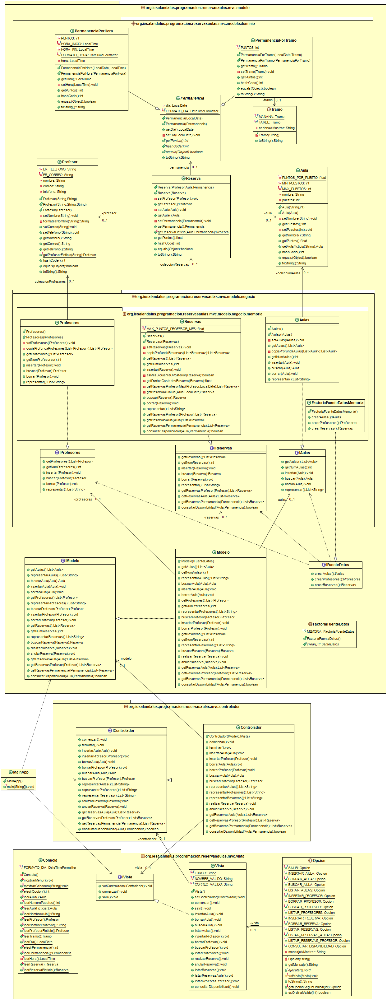

# Tarea Reservas de Aulas
## Profesor: Andrés Rubio del Río
## Alumno: José Francisco Hernández Allen

Desde el IES Al-Ándalus nos acaban de dar unos nuevos requisitos a aplicar sobre la última versión que le mostramos y que les gustó bastante. Lo que nos piden es lo siguiente:

Quieren conservar la interfaz de texto de la aplicación.
Quieren también tener una nueva interfaz de usuario gráfica para ejecutar la aplicación.
Tu tarea consiste en dotar a la aplicación de la tarea anterior de una interfaz gráfica de usuario, utilizando JavaFX. La interfaz se puede diseñar al gusto de cada un@, pero deberá utilizar los componentes más adecuados en cada caso. Cuanto más elaborada esté mayor será la calificación. Para ello debes emplear los diferentes tipos de controles, menús y contenedores que nos proporciona la API de JavaFX. Se pide al menos:

Un menú que nos permita salir de la aplicación, o acceder a las diferentes opciones sobre aulas, profesores y reservas.
La gestión de aulas permitirá añadir una nueva, borrar una ya existente, mostrar todas las aulas, mostrar las reservas de un aula o consultar su disponibilidad.
La gestión de profesores permitirá añadir uno nuevo, borrar uno ya existente y mostrar todos los profesores. También permitirá mostrar las reservas de un profesor.
La gestión de reservas nos permitirá realizar una nueva reserva o anular una reserva dada. También permitirá mostrar todas las reservas.
Por tanto, tu tarea va a consistir en completar los siguientes apartados:

-Debes realizar un fork del repositorio de tu tarea anterior en otro nuevo llamado ReservasAulas-v4. Dicho repositorio lo clonarás localmente y realizarás las diferentes modificaciones que se piden en esta tarea.
-Modifica el fichero de configuración de gradle para que incluya las librerías necesarias para poder trabajar correctamente con JavaFX. Crea un nuevo paquete para la vista gráfica. En principio la ventana principal sólo incluirá el menú adecuado. -Cada fichero debe estar en la carpeta adecuada (bien sea un recurso -imagen o .fxml- o un fichero .java). Realiza el commit correspondiente.
-Mueve la interfaz textual al paquete adecuado y renombra la aplicación que utilizaba dicha interfaz textual. Realiza un commit.
-Crea un nuevo paquete para la vista gráfica. Crea una nueva aplicación que haga uso de dicha interfaz gráfica de usuario y que contenga el menú adecuado. Realiza un commit.
-Realiza la gestión de aulas tal y como se indica anteriormente. Realiza un commit.
-Realiza la gestión de profesores tal y como se indica anteriormente. Realiza un commit.
-Realiza la gestión de reservas tal y como se indica anteriormente. Realiza un commit.
-Al final debes tener dos aplicaciones que utilicen el mismo modelo, pero que una utilice la interfaz textual y otra la interfaz gráfica. Realiza un commit y sube los cambios a tu repositorio remoto.

Se valorará:

-La nomenclatura del repositorio de GitHub y del archivo entregado sigue las indicaciones de entrega.
-La indentación debe ser correcta en cada uno de los apartados.
-El nombre de las variables debe ser adecuado.
-Se debe utilizar la clase Entrada para realizar la entrada por teclado.
-El proyecto debe pasar todas las pruebas que van en el esqueleto del mismo y toda entrada del programa será validada para evitar que el programa termine abruptamente debido a una excepción.
-Se deben utilizar los comentarios adecuados.
-Se valorará la corrección ortográfica tanto en los comentarios como en los mensajes que se muestren al usuario.